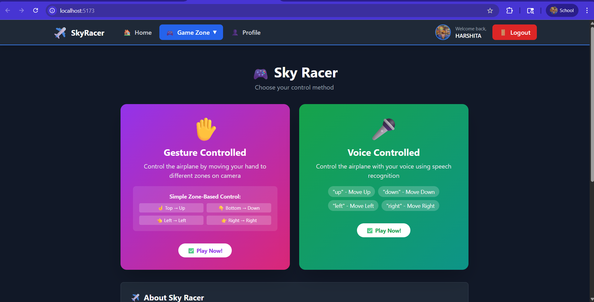
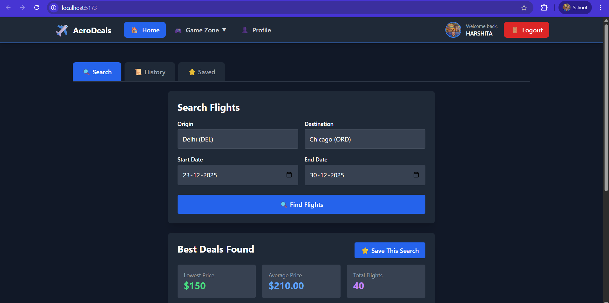
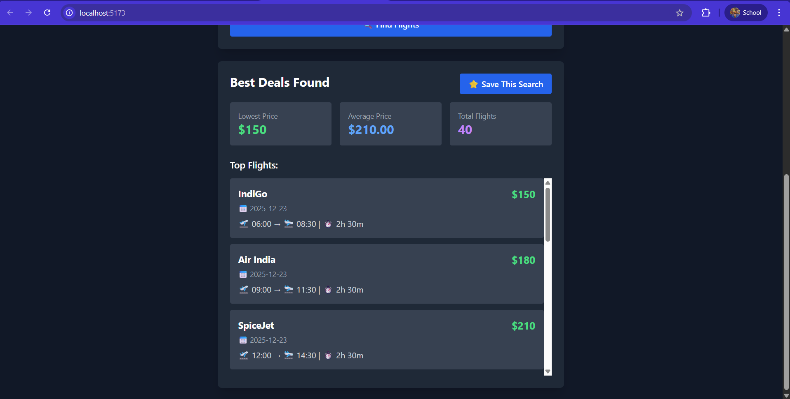
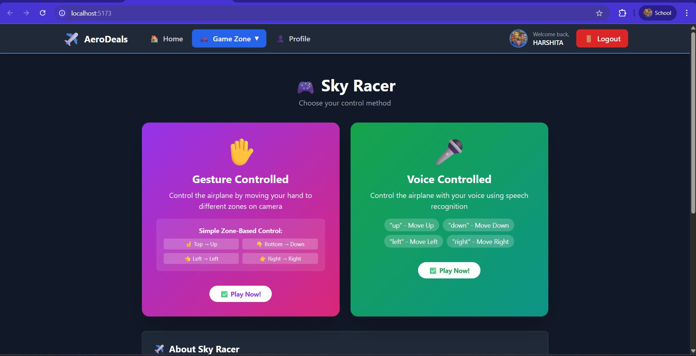
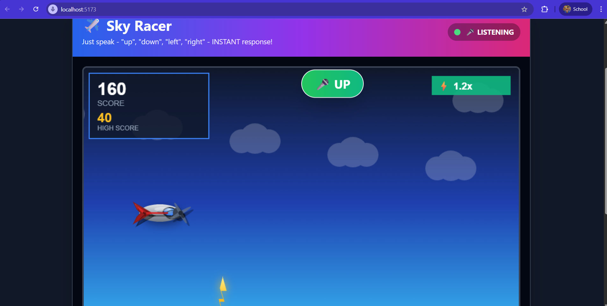
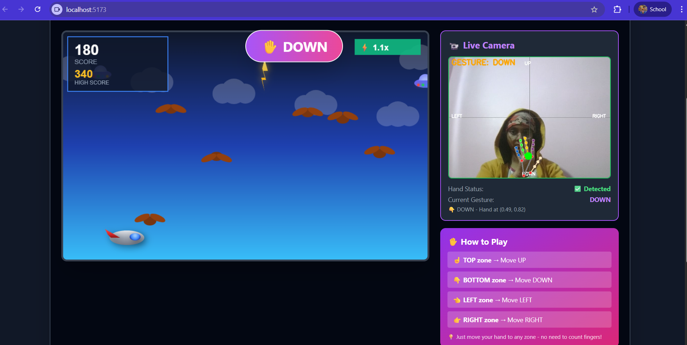
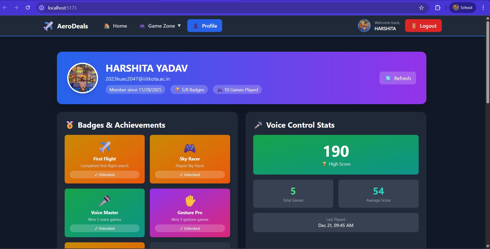
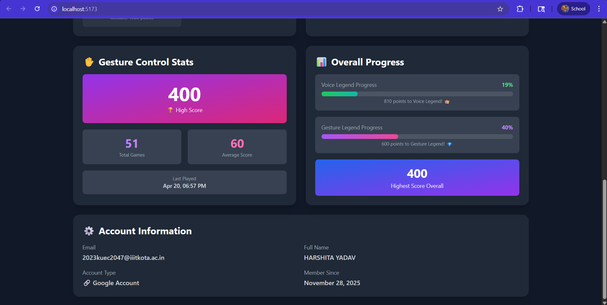

# ✈️ AeroDeals

**Find the best flight deals and play interactive AI-powered games!**

AeroDeals is a full-stack application that combines flight search functionality with innovative voice and gesture-controlled games. Built with React, FastAPI, MongoDB, Web Speech API, and MediaPipe technologies.



---

## 🚀 Features

### ✈️ Flight Search Module

Search for flights with smart city autocomplete and save your favorite searches.



**Key Features:**
- 🔐 Secure JWT & Google OAuth authentication
- 🔎 Smart city/airport search with autocomplete
- 💰 Price analysis (lowest, average, total flights)
- 📜 Auto-save searches for 7 days
- ⭐ Bookmark favorite searches permanently
- 🗄️ MongoDB with user data isolation

> **Note:** Flight data is simulated for demonstration. Production version supports integration with Amadeus, SkyScanner, or custom APIs.



---

### 🎮 Game Zone - Sky Racer

Choose your control method and navigate through obstacles!



#### 🎤 Voice Controlled Mode

Control the airplane with your voice commands.



**Features:**
- Real-time speech recognition (Web Speech API)
- Instant response: "up", "down", "left", "right"
- Progressive difficulty with speed multipliers
- Score tracking per user

#### ✋ Gesture Controlled Mode

Move your hand to different screen zones to control the airplane.


**Features:**
- MediaPipe hand tracking with landmarks
- Zone-based controls (no finger counting!)
- Live video feed with hand visualization
- Auto camera shutdown after game



**Obstacles to Avoid:**
- 🦅 Birds
- ⚡ Lightning bolts
- ☁️ Clouds
- 🛸 UFOs

---

### 👤 User Profile & Statistics

Track your progress and unlock achievements.



**Dashboard Features:**
- 🏅 8 unique achievement badges
- 📊 Separate stats for voice & gesture modes
- 🏆 High scores and total games played
- 📈 Progress bars to legend status
- ✈️ Flight search activity tracking



---

## 🛠 Tech Stack

| Category | Technologies |
|----------|-------------|
| **Frontend** | React, Tailwind CSS, Canvas API |
| **Backend** | FastAPI, Motor (Async MongoDB), WebSockets |
| **AI/ML** | MediaPipe Hand Tracking, Web Speech API |
| **Database** | MongoDB Atlas, JWT Authentication |

---

## ⚙️ Quick Start

### Prerequisites
- Node.js v16+
- Python 3.8+
- MongoDB Atlas account
- Chrome browser
- Webcam & Microphone

### Installation & Setup

```bash
# Clone repository
git clone https://github.com/harshitayadavv/AeroDeals.git
cd AeroDeals

# Backend setup
python -m venv venv
venv\Scripts\activate  # Windows
# For Mac/Linux: source venv/bin/activate
pip install -r requirements.txt

# Create backend .env file
# Copy and edit with your credentials
MONGODB_URI=your_mongodb_connection_string
DATABASE_NAME=aerodeals
SECRET_KEY=your_secret_key  # openssl rand -hex 32
GOOGLE_CLIENT_ID=your_google_client_id
ALGORITHM=HS256
ACCESS_TOKEN_EXPIRE_MINUTES=10080
ENVIRONMENT=development

# Run backend
uvicorn main:app --reload --host 0.0.0.0 --port 8000
```

**In a new terminal:**

```bash
# Frontend setup
cd frontend
npm install

# Create frontend .env file
# Copy and edit with your credentials
VITE_API_URL=http://127.0.0.1:8000
VITE_GOOGLE_CLIENT_ID=your_google_client_id

# Run frontend
npm run dev
```

**Access the application:**
- Frontend: http://localhost:5173
- Backend API: http://localhost:8000
- API Docs: http://localhost:8000/docs

---

## 🎮 How to Play

### Voice Control
1. Game Zone → Voice Controlled
2. Allow microphone access
3. Speak: "up", "down", "left", "right"
4. Avoid obstacles and beat your high score!

### Gesture Control
1. Game Zone → Gesture Controlled
2. Allow webcam access
3. Move hand to screen zones:
   - **Top** → UP
   - **Bottom** → DOWN
   - **Left** → LEFT
   - **Right** → RIGHT
4. Watch live video feed with hand landmarks!

---

## 🏆 Achievements

- 🎮 **Sky Racer** - Play your first game
- 🎤 **Voice Master** - Win 5 voice games
- ✋ **Gesture Pro** - Win 5 gesture games
- 🏆 **High Scorer** - Reach 100 points
- ⭐ **Pro Pilot** - Reach 500 points
- 👑 **Voice Legend** - 1000 points in voice mode
- 💎 **Gesture Legend** - 1000 points in gesture mode
- ✈️ **First Flight** - Complete first search

---

## 🔒 Security Features

- JWT-based authentication
- Password hashing (bcrypt)
- Google OAuth 2.0 integration
- User data isolation in MongoDB
- Secure WebSocket connections
- Environment-based configuration

---

## 📞 Support

Having issues?
1. Check [GitHub Issues](https://github.com/harshitayadavv/AeroDeals/issues)
2. Review troubleshooting in documentation

---

## 🤝 Contributing

Contributions welcome! Please:
1. Fork the repository
2. Create a feature branch
3. Submit a Pull Request

---

## 📄 License

MIT License - see [LICENSE](LICENSE)

---

## 👥 Author

**Harshita Yadav**  
GitHub: [@harshitayadavv](https://github.com/harshitayadavv)

---

## ⭐ Star this repo if you find it helpful!

**Made with ❤️ by Harshita Yadav**

---

## 📊 Project Status

| Feature | Status |
|---------|--------|
| Flight Search | ✅ Complete |
| Voice Game | ✅ Complete |
| Gesture Game | ✅ Complete |
| User Profiles | ✅ Complete |
| Achievements | ✅ Complete |

**Latest Release:** v2.0.0 - Gesture Control Support 🎉

---

## 🚀 Future Enhancements

- Real-time flight API integration
- Price alerts and notifications
- Mobile app (React Native)
- Additional game modes
- Global leaderboards
- Multi-language support